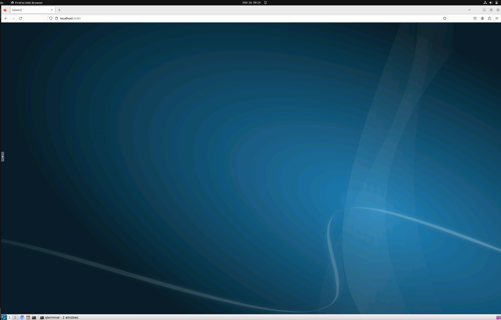

# Steps the built the entire container again


## Features

- Clone the repository
- Built the docker image
- ```cmd
  docker build -t
- Initialize the linux and ros environment in the browser by running the docker file
- ```cmd
  docker run -it --rm -p 6080:80 replace_with_containerid
- In the browser go to http://localhost:6080/ and you will see an entire linux GUI running inside the browser
- 

    
## How to Use

1. First, do this.
2. Then, do that.
3. Finally, you're all set!

## Contributors

- John Doe
- Jane Smith
- Alex Johnson
